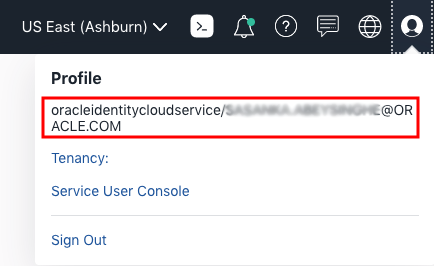
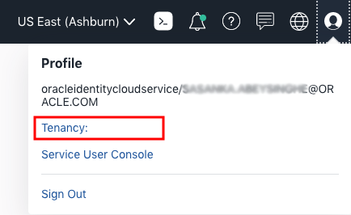
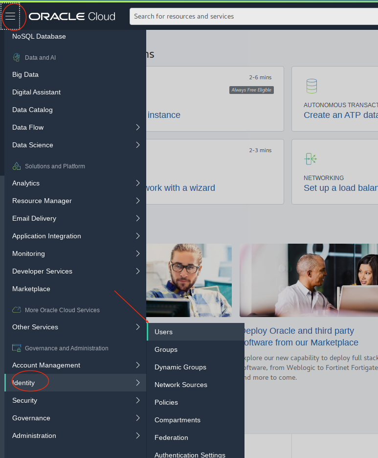
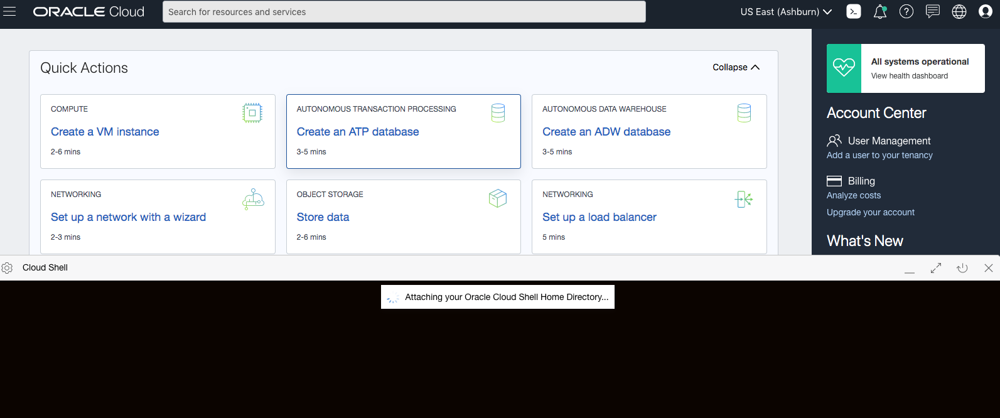
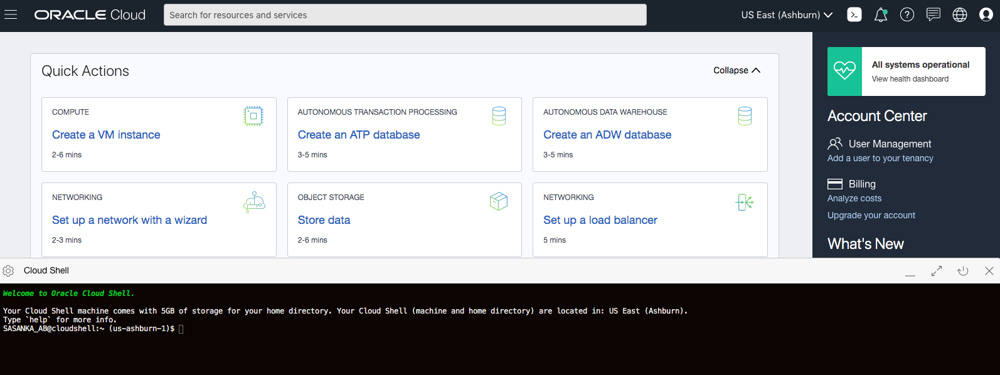
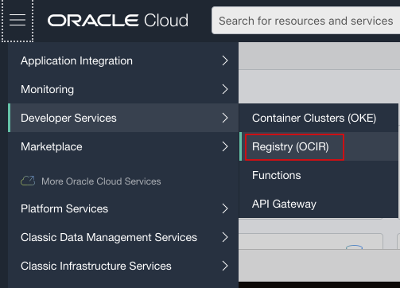
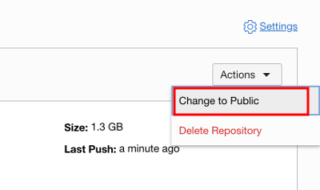

# Lab 1: Pull the Docker image for the WebLogic and push to Oracle Cloud Infrastructure Registry (OCIR)

## Before You Begin
### Objectives
- Sign in to Oracle Cloud Infrastructure
- Get Authentication Token to use Oracle Cloud Infrastructure Registry (OCIR)
- Pull Docker images for the operator and push to Oracle Cloud Infrastructure Registry (OCIR)

### Requirements
To complete this lab, you need to have the following:
- Login credentials and a tenancy name for the Oracle Cloud Infrastructure Console
- Login credentials for Docker

***To log issues***, click here to go to the [github oracle](https://github.com/oracle/learning-library/issues/new) repository issue submission form.

***We recommend that you create a notes page to write down all of the credentials you will need.***

## **STEP 1:** Your Oracle Cloud Trial Account

You have already applied for and received your Oracle Cloud Free Tier Account.

## **STEP 2:** Log in to your OCI dashboard and retrieve information required to create resources.

- From any browser go to oracle.com to access the Oracle Cloud.

    [https://www.oracle.com/](https://www.oracle.com/)

    

- Click the icon in the upper right corner.  Click on **Sign in to Cloud** at the bottom of the drop down.   

     
 
- Enter your **Cloud Account Name** in the input field and click the **Next** button.  *NOTE:  Do NOT click the Sign-In button, this will take you to Single Sign-On, not the Oracle Cloud*

  
    
- Enter your username (this may be your email address) and password and click on **Sign In**.  **Note this is NOT your email. This is the name of your tenancy noted in the email you received during signup**

  

- Once you log in you will see a page similar to the one below.

   

- Click on the profile icon in the top right.

  

- Copy the **Username** in your notes.

  

- Then click into the tenancy link.
  
  

- Copy the **Object Storage Namespace** in your notes.

  

## **STEP 3:** Generate your Auth Token

- Generate an Auth Token.  Navigate to **Identity** > **Users**.  

  

- Select the username of the current logged in userid (yours will be different from the screenshot). Save that name in your notes.

  

- Select **Auth Tokens** on the left, and then **Generate Token**.  Create token **weblogic_token**.

  

  

- Copy the token and save it in your notes.  If you lose this you can always generate more tokens.

  

## **STEP 4:** Log in to your OCI dashboard Cloud Shell.

- Click Cloud Shell icon.
  
  

- Await while to your load Cloud Shell.
  
  

- You can see your Cloud Shell now.

  

## **STEP 5:** Push WebLogic Docker image to OCIR .

- Since we are pushing to a Oracle Cloud Infrastructure Registry (OCIR), Cloud Shell will use Oracle's Docker registry, OCIR, as the container registry. Log in to Registry. When prompted for a password, enter the auth token that you just generated (Refer to your notes).
  
<copy>docker login -u YOUR_TENANCY_NAMESPACE/YOUR_USERNAME iad.ocir.io<copy> 

- Copy docker pull command in to Cloud Shell to pull WebLogic image.

<copy>docker pull store/oracle/weblogic:12.2.1.3<copy>

- See your image properly pulled
  
<copy> docker images <copy>

- Copy Image ID and Tag it according to your **iad.ocir.io/tenancy/weblogic**

<copy>docker tag **IMAGE_ID** iad.ocir.io/**TENANCY**/weblogic<copy>

- Push it back to OCIR 

<copy> docker push iad.ocir.io/**TENANCY**/weblogic <copy>

- Open the OCI Console website in a browser on your local machine. From the Developer Services section of the navigation menu, choose Registry (OCIR)
  

- Click on **weblogic**, the name of your image.

- From the Actions drop down, click Change to Public.

***

**This completes the Lab!**

**You are ready to proceed to Lab 2**
